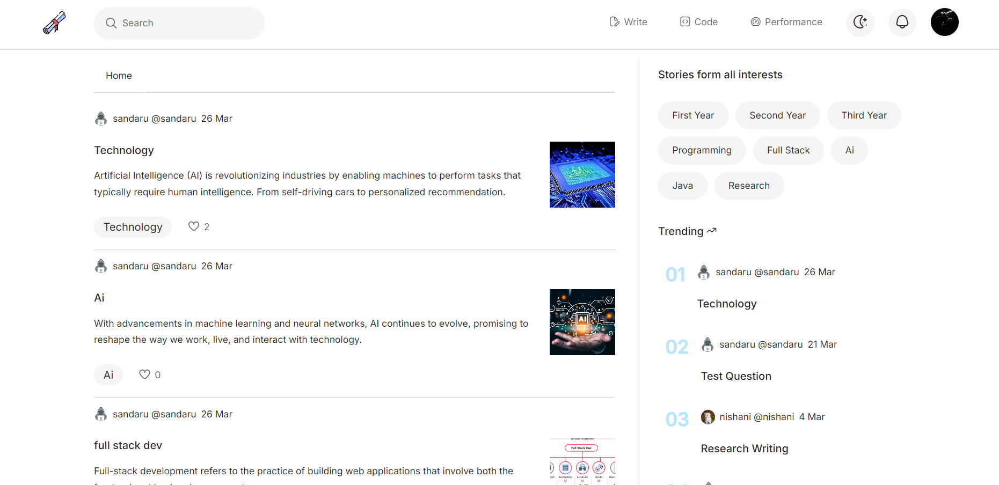
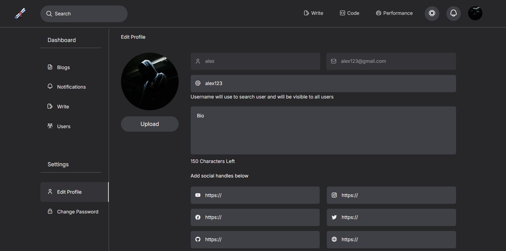
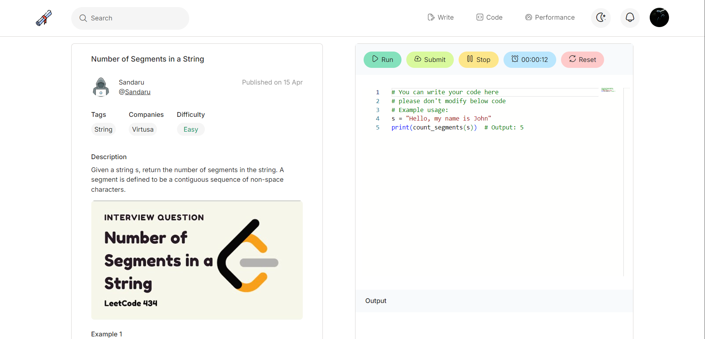

<p align="center">
  
  
</p>

<p align="center">
  
  
</p>


# [DevLink: A Collaborative Learning & Interview Preparation Platform](#DevLink)

## 📋 [Table of Contents](#table-of-contents)
1. 🤖 [Introduction](#introduction)
2. ⚙️ [Tech Stack](#tech-stack)
3. 🔋 [Features](#features)
4. 🤸 [Quick Start](#quick-start)


## 🤖 [Introduction](#introduction)
DevLink is a web application designed to address key challenges faced by computing students in Sri Lanka. It facilitates collaborative learning and enhances interview preparation through features like role-based authentication, blog posting, nested comments, an interactive notification system, and an interview preparation module with a built-in code editor. The platform bridges the gap between academia and industry by fostering knowledge sharing and mentorship, making it easier for students to connect, learn, and succeed in their career journey.

## ⚙️ [Tech Stack](#tech-stack)

- **Frontend**: React.js
- **Backend**: Node.js with Express
- **Database**: MongoDB
- **Styling**: Tailwind CSS

## 🔋 [Features](#features)
👉 **User Authentication & Role-based Access**: Secure account creation and login system with different functionalities based on user roles (students, lecturers, etc.).

👉 **Profile Customization**: Users can view, edit, and manage their profiles, displaying their blogs, questions, and personal information.

👉 **Content Interaction**: Users can post blogs and questions, leave comments, and engage in discussions using a nested comment system with upvote and downvote features.

👉 **Rich Content Editor**: A dynamic blog editor that supports images, code snippets, fonts, quotes, and previews.

👉 **Interview Preparation Module**: Features a code editor, timed sessions, and filters for browsing questions by category and company.

👉 **Performance Tracking**: Students can track their progress, view leaderboards, and monitor their submissions.

👉 **Notification System**: Receive notifications when users interact with your posts (comments, likes, etc.).

👉 **Light and Dark Themes**: Switch between light and dark modes for a personalized user experience.

and many more, including code architecture and reusability.

## 🤸 [Quick Start](#quick-start)
1. **Clone the repository**:
   ```bash
   git clone https://github.com/vidmal001/DevLink.git
   ```

2. **Navigate to the client folder**:
   ```bash
   cd client
   ```

3. **Install the client dependencies**:
   ```bash
   npm install
   ```

4. **Navigate to the server folder**:
   ```bash
   cd server
   ```

5. **Install the server dependencies**:
   ```bash
   npm install
   ```

6. **Set up environment variables**:
   
   **Client Side (.env)**:
   - Navigate to the `client` folder.
   - Create a file named `.env` in the root.
   - Add the following line:
     ```env
     VITE_SERVER_DOMAIN = http://localhost:3000
     ```

   **Server Side (.env)**:
   - Navigate to the `server` folder.
   - Create a file named `.env` in the root.
   - Add the following:
     ```env
     DB_LOCATION = mongodb+srv://<your-database-username>:<your-database-password>@cluster0.mongodb.net/?retryWrites=true&w=majority
     SECRET_ACCESS_KEY = <your-secret-access-key>
     ```
   **How to Generate and Add a Secret Access Key for JWT**
   - Generate a Secure Key: You can generate a secure secret access key using a secure password generator tool like [passwordsgenerator.net](https://passwordsgenerator.net) or by running the following command in your terminal:
     ```bash
     openssl rand -hex 64
     ```

7. **Run the client**:
   ```bash
   npm run dev
   ```

8. **Run the server**:
   ```bash
   npm start
   ```

Now the application should be running at [http://localhost:5173](http://localhost:5173).
